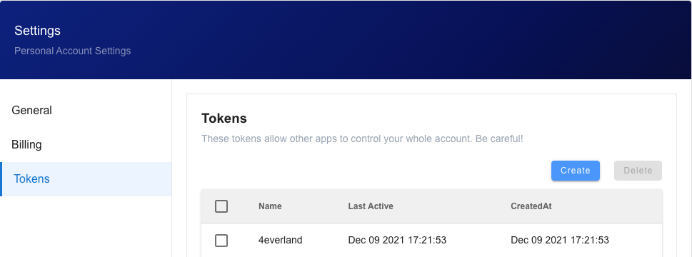
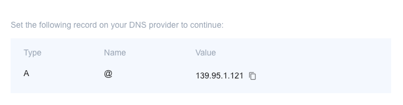
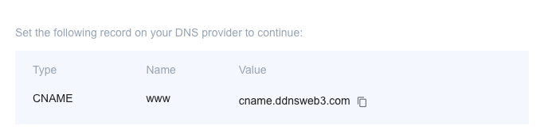

# CLI Documentation

## Introduction

Hosting offers a command-line interface for the 4everland CLI, which enables you to deploy and manage projects with a set of commands. This makes it easier for you to interact with the platform using a terminal or automated system. The commands and parameters available in the 4everland CLI are listed below.

If you want to programmatically interact with the platform. Please check out the [CLI API](/api/cli/Auth.html)

## Install

You can install the 4everland CLI by running the 'npm install -g @4everland/hosting-cli' command.

```
npm install -g @4everland/hosting-cli
```

## View Version

You can view the current version of the 4everland CLI by running the '4ever-hosting -v' command.

```
4ever-hosting -v
```

## Login

You can login your Hosting account via the 4everland CLI by running the '4ever-hosting login' command.

```
4ever-hosting login
```

### Enter Token

You can see your token in the Hosting setting.



The following operations are available only after successful login:

- Project Deployment

- Domain Operation

## Deployment

To deploy a project, please run the '4ever-hosting deploy' command.

```
4ever-hosting deploy
```

## Domain

To bind the domain, please run the '4ever-hosting domain -a' command.

```
4ever-hosting domain -a
```

### Adding an A Record

Please complete the domain binding procedure in the console based on the <font color='cornflowerblue'>'value'</font> and <font color='cornflowerblue'>'type'</font>. value is <font color='cornflowerblue'>'139.95.1.121'</font>



### Adding a CNAME Record

Please complete the domain binding procedure in the console based on the <font color='cornflowerblue'>'value'</font> and <font color='cornflowerblue'>'type'</font>. value is <font color='cornflowerblue'>'cname.ddnsweb3.com' </font>



### View Domain List

You can view the domain list for the current project by running the '4ever-hosting domain -ls' command

```
4ever-hosting domain -ls
```

### Validate Domain

After setting the 'value', please validate if the domain is correctly bound by running the '4ever-hosting domain -c' command

```
4ever-hosting domain -c
```
