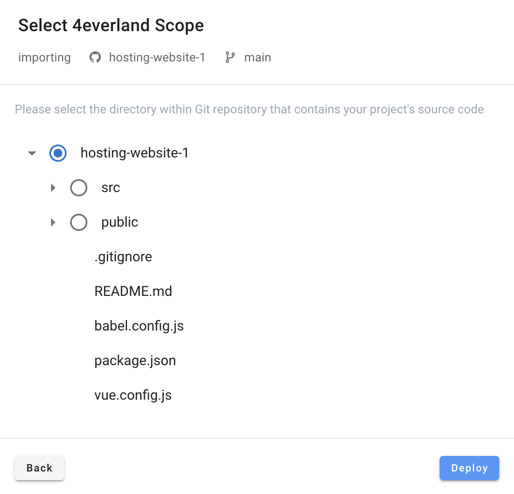
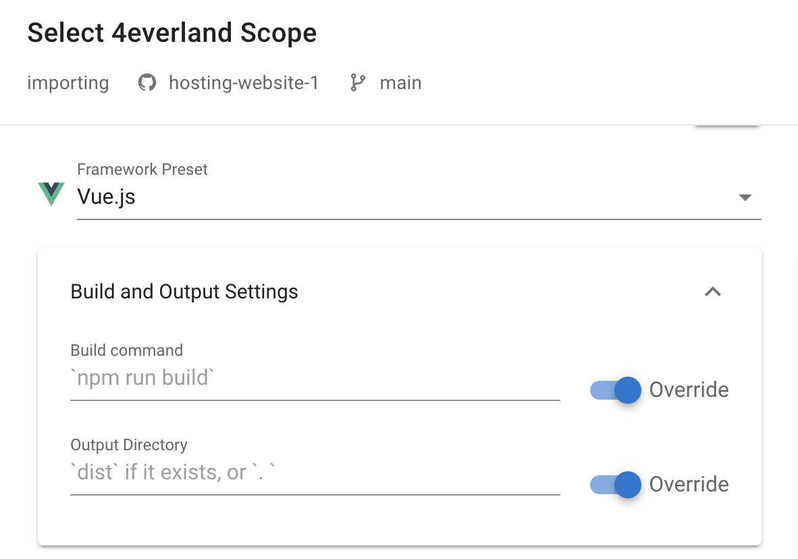
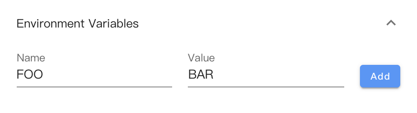
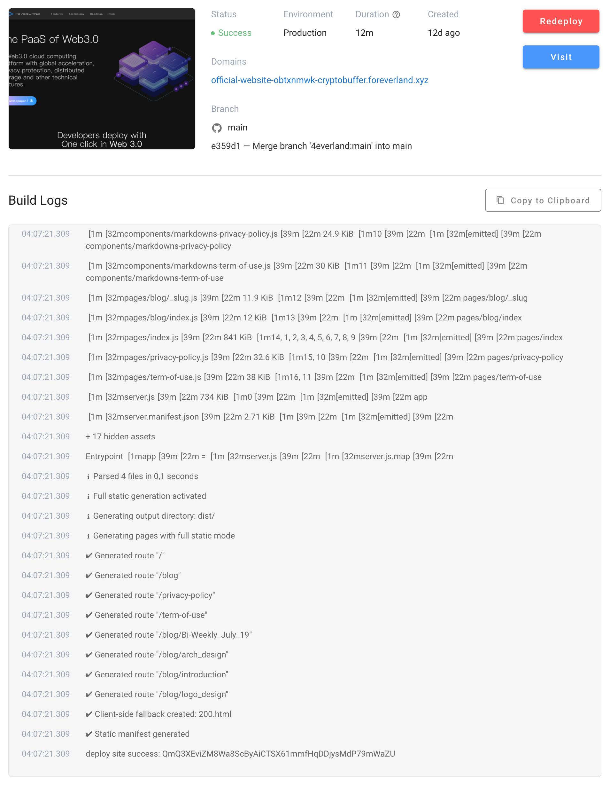
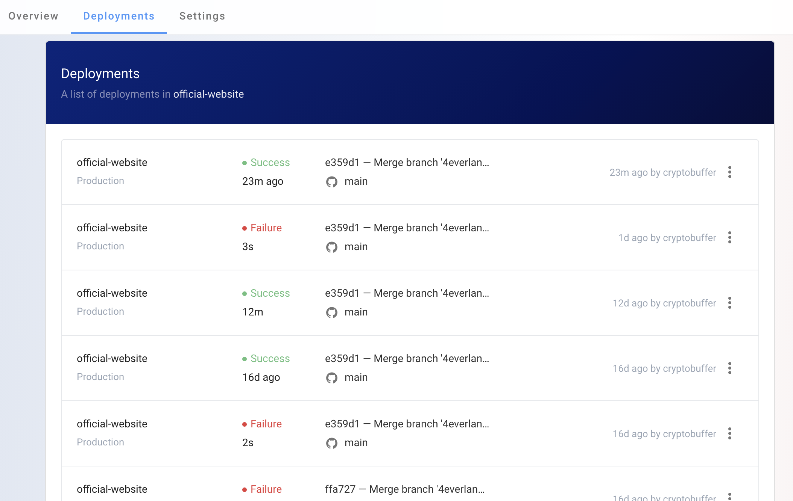

# Build Step

<iframe width="560" height="315" src="https://www.youtube.com/embed/7D9MuVk6NNA" title="YouTube video player" frameborder="0" allow="accelerometer; autoplay; clipboard-write; encrypted-media; gyroscope; picture-in-picture" allowfullscreen></iframe>

Start a deployment, click on "Import", then select your connected git account.

## Step1: Setup Root Directory

Setup the root directory, for most of the project just keep it default, for monorepo, a sub directory could be selected, this is where `npm install` and build command runs.

## Step2: Configurate Build Settings

A default framework should be selected after root directory is set. A framework would have default `Build Commands` and `Output Directory`, switch on `Override` to override default settings.

## Step3: Environment Variables

Optionally, Set `Environment Variables` if required, which could be accessed via `process.env.VARIABLE_NAME` in your code.

Click on deploy to continue, then a new build process will be started.

## Step4: Checkout build status

Build status:

- Created: A new task is created
- Queued: The task is pending in a queue, should be processed soon
- Running: The task is running in progress
- Success: All building steps, deployment steps is done
- Failure: Exception/Error while building or deploy the site

## Step5: Checkout deployment history

- Click on the logo to return to the project list
- Click on a project to checkout details
- Click on `Deployments` on the navigation tab to checkout deployment histories

If the build steps failed and build settings needs to be updated, checkout [Project Settings](./settings.md)
