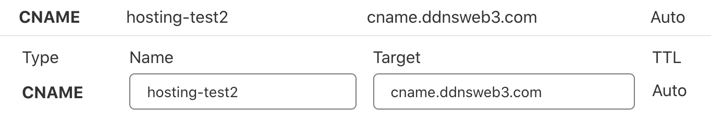

# Custom Domains

<iframe width="560" height="315" src="https://www.youtube.com/embed/yiKjf-GwaGg" title="YouTube video player" frameborder="0" allow="accelerometer; autoplay; clipboard-write; encrypted-media; gyroscope; picture-in-picture" allowfullscreen></iframe>

A free and SSL enabled domain will be automatically generated as soon as a deployment is succeed. If you have your own domain name, you can also connect it to your site, just follow the prompts to configure a `CName` record.

## Step1: Configure CName record

Add the following `CName` record in your DNS records

| Type  | Name              | Target             |
| ----- | ----------------- | ------------------ |
| Cname | <SUB_DOMAIN_NAME> | cname.ddnsweb3.com |

## Step2: Configure Custom domain

- Navigate to a project
- Click on `Settings` on the navigation tab, and navigate to `Domains` in the sub sections
- Add the configured domain name

