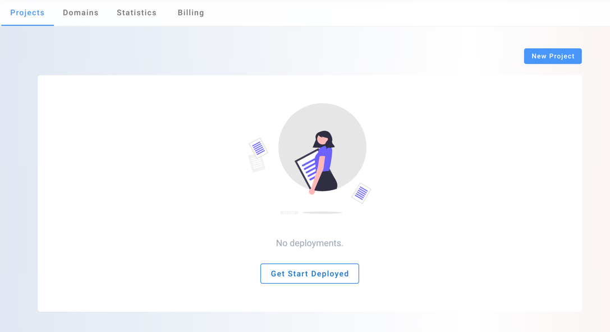
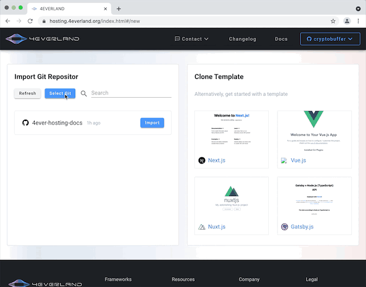

# Connect to Github

This document will introduce how to log in to 4ever-hosting through a Github account. Before starting, please make sure that you have a Github account and have logged in.

## Step1: Login via github

In many places on 4everland, you can find the login entrance. A 4ever-hosting account will be easily created when you click on login, then authorize.

## Step2: New Project

Click on [New Project](https://hosting.4everland.org/#/new) to start a new deployment, for the first of time you may need to buy or claim resources(Storage and Network).

## Step3: Import git repos

Click on "Select Git" to import your git repositories.

Since then, you have completed 4ever-hosting account creation and connected to your github account. Congratulations, we are ready to the [next step](./build.md).
