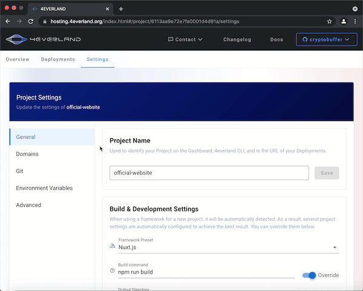

# Project Settings

- Navigate to a project
- Click on `Settings` on the navigation tab to modify build settings

Following settings are supported:

- General
  - Update project name
  - Update build settings: `Root Directory`, `Build Command`, `Output Directory` etc.
- Domains
  - Custom domains for current project
- Git
  - Connect or disconnect to a git repository
  - Modify production branch
  - Manage webhooks for auto deployment on code commit
- Environment Variable
  - Manage Environment Variables
- Advance
  - Web Statistics switch
  - Delete a project
